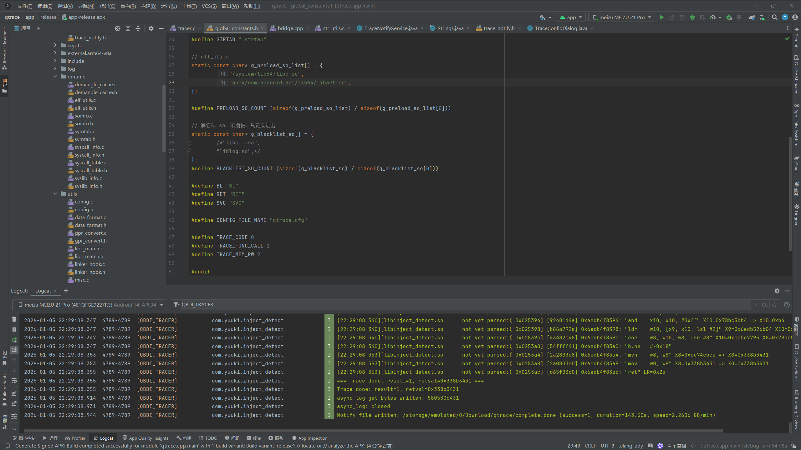
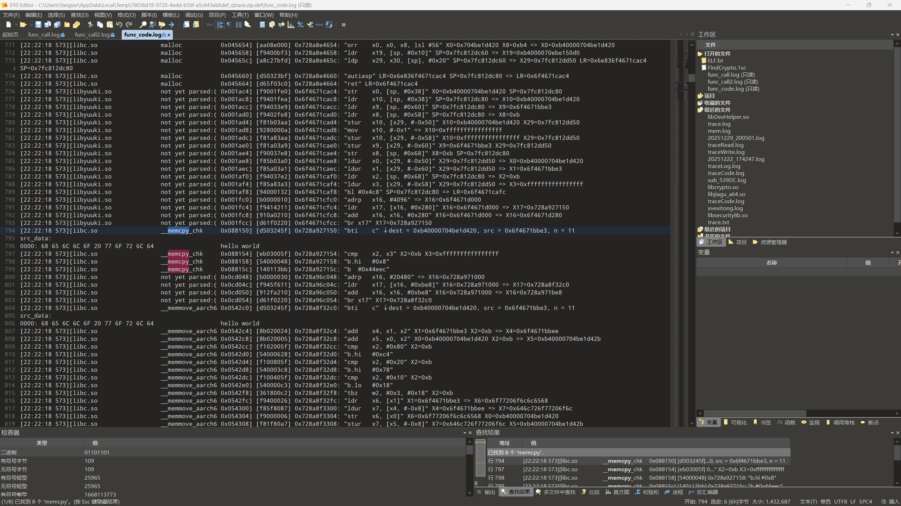
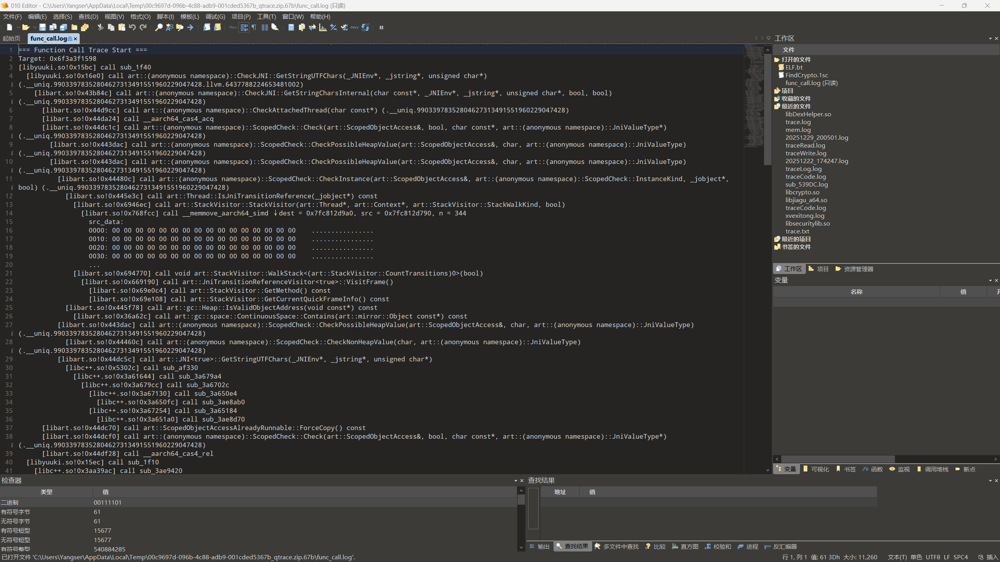
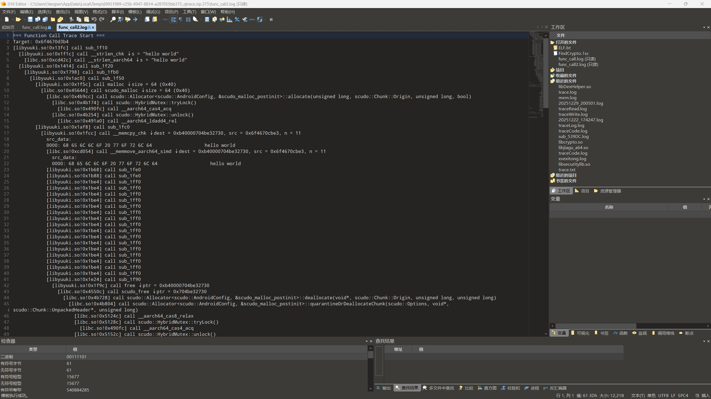

# qtrace


 

## 速度

2GB+/min

 

## 格式

```bash
libName!{symbolInfo}!{traceType}
```

其中：

1. **symbolInfo**可以是符号名(并不保证百分百能解析出偏移)、偏移地址、IDA反汇编风格函数名(sub_xxxx)
2. **traceType**定义
   1. *func_code*：常规汇编流
   2. *func_call*：函数调用关系
   3. *mem_rw*：内存读写情况


## 日志格式

### func_code

 


### func_call
 
 


## 鸣谢

部分代码参考了**追佬的vm-trace** 欢迎大家使用vm-trace
